# Plan poprawy UX i funkcji DINBoard

## Faza 1: Krytyczne braki funkcjonalne

### 1.1 PowerConfigPanel -- podpiecie do danych projektu

`PowerConfigPanel.axaml` ma UI (ComboBox napiecia, zabezpieczenie glowne, moc przylaczeniowa, RCD) ale zadne pole nie jest zbindowane do `Project.PowerConfig`.

- Zbindowac `ComboBox` napiecia do `CurrentProject.PowerConfig.Voltage`
- Zbindowac zabezpieczenie glowne do `CurrentProject.PowerConfig.MainProtection`
- Zbindowac moc przylaczeniowa do `CurrentProject.PowerConfig.PowerKw`
- Zbindowac konfiguracje faz do `CurrentProject.PowerConfig.Phases`
- Dodac `PropertyChanged` -> `RecalculateValidation()` po kazdej zmianie
- Pliki: [Views/PowerConfigPanel.axaml](Views/PowerConfigPanel.axaml), [Views/PowerConfigPanel.axaml.cs](Views/PowerConfigPanel.axaml.cs), [Models/Project.cs](Models/Project.cs)

### 1.2 GroupedCircuitsPanel -- podpiecie w MainWindow

`GroupedCircuitsPanel` jest zaimplementowany (zwijanie/rozwijanie grup, kontekstowe menu, przenoszenie miedzy grupami) ale nie jest widoczny w `MainWindow.axaml`.

- Dodac `GroupedCircuitsPanel` jako tab lub sekcje w prawym panelu (obok "Konfiguracja", "Bilans", "Walidacja")
- Zbindowac do `MainViewModel.CurrentProject.Groups` / symboli pogrupowanych
- Plik: [MainWindow.axaml](MainWindow.axaml) -- dodac nowy `TabItem` w prawym panelu

### 1.3 Skroty klawiszowe

Menu pokazuje skroty (Ctrl+N, Ctrl+O, Ctrl+S) ale nie sa podpiete w `KeyBindings`. Tylko Delete i Ctrl+D dzialaja (hardkodowane w `MainWindow_KeyDown`).

- Dodac `KeyBindings` w `MainWindow.axaml`:
  - `Ctrl+N` -> `Workspace.CreateProjectCommand`
  - `Ctrl+O` -> `Workspace.LoadCommand`
  - `Ctrl+S` -> `Workspace.SaveCommand`
  - `Ctrl+Shift+S` -> `Workspace.SaveAsCommand`
  - `Ctrl+Z` -> `UndoCommand`
  - `Ctrl+Y` -> `RedoCommand`
  - `Ctrl+D` -> `ModuleManager.DuplicateSelectedCommand`
  - `Ctrl+P` -> `Exporter.ExportPdfCommand`
  - `Ctrl+Plus` / `Ctrl+Minus` -> Zoom In/Out
  - `Ctrl+0` -> Zoom Fit
- Usunac reczna obsluge z `MainWindow_KeyDown` (Delete/Ctrl+D) na rzecz `KeyBindings`
- Plik: [MainWindow.axaml](MainWindow.axaml), [MainWindow.axaml.cs](MainWindow.axaml.cs)

---

## Faza 2: Informacja zwrotna i UX

### 2.1 Eksport -- lepsza informacja zwrotna

Obecnie eksport aktualizuje tylko `StatusMessage`. Bledy sa logowane ale uzytkownik ich nie widzi.

- Dodac toast sukcesu po ukonczeniu eksportu PDF/PNG/BOM (zielony "Wyeksportowano do X")
- Dodac toast bledu gdy eksport sie nie powiedzie (czerwony z opisem)
- Dodac walidacje przed eksportem PDF: jesli sa bledy walidacji, pokazac dialog potwierdzenia "Projekt zawiera X bledow. Kontynuowac?"
- Pliki: [ViewModels/ExportViewModel.cs](ViewModels/ExportViewModel.cs), [Services/DialogService.cs](Services/DialogService.cs)

### 2.2 Tooltipsy

Wiele kontrolek nie ma tooltipsow. Priorytet:

- **PowerConfigPanel**: opisy pol (co oznacza napiecie, zabezpieczenie glowne)
- **PowerBalancePanel**: opisy L1/L2/L3 barow, wyjasnienies asymetrii
- **Dialogi**: przycisk "Generuj" w BusbarGeneratorDialog, opcje w CircuitConfigDialog
- **Prawy panel**: ikony tabow
- **DataGrid (CircuitListView)**: naglowki kolumn
- Pliki: odpowiednie `.axaml` kazdego widoku

### 2.3 Zakladka Settings/Widok -- opcje wyswietlania

Zakladka "Widok" w Settings flyout jest pusta (tylko naglowek "Opcje wyswietlania:").

- Dodac opcje: pokaz/ukryj siatke, pokaz/ukryj osie szyny DIN, pokaz/ukryj numery stron
- Dodac suwak rozmiaru ikon w palecie modulow
- Zbindowac do `SchematicViewModel` (nowe property)
- Plik: [MainWindow.axaml](MainWindow.axaml) -- sekcja `SettingsFlyout`

---

## Faza 3: Strategiczne funkcje

### 3.1 Lokalizacja -- migracja na Strings.axaml

`Resources/Strings.axaml` istnieje z ~132 kluczami ale nie jest uzywany w zadnym widoku. Wszystkie stringi sa hardkodowane po polsku.

- **Etap 1**: Zamiana stringow w `MainWindow.axaml` na `{StaticResource Key}` (~50 stringow)
- **Etap 2**: Zamiana w dialogach (~30 stringow)
- **Etap 3**: Zamiana w Views (~40 stringow)
- **Etap 4**: Zamiana w code-behind (`StatusMessage`, toast messages) -- uzyc helpera `Strings.Get("key")`
- Pliki: wszystkie `.axaml` i `.axaml.cs`, [Resources/Strings.axaml](Resources/Strings.axaml)

### 3.2 Import z Excela

`ExcelDataReader` i `ExcelDataReader.DataSet` sa w zaleznosciach ale nie uzywane. Mozliwosc importu listy obwodow z arkusza Excel.

- Dodac `ExcelImportService` -- odczyt kolumn: nazwa obwodu, moc, faza, zabezpieczenie, kabel
- Dodac dialog wyboru pliku `.xlsx` i mapowania kolumn
- Po imporcie: utworzenie `SymbolItem` dla kazdego wiersza, dodanie do `Symbols`
- Dodac przycisk "Importuj z Excel" w menu Plik lub w pasku narzedzi
- Pliki: nowy `Services/ExcelImportService.cs`, nowy `Dialogs/ExcelImportDialog.axaml`

---

## Diagram kolejnosci

```mermaid
gantt
    title Plan UX/Funkcji DINBoard
    dateFormat X
    axisFormat %s
    section Faza1_Krytyczne
    PowerConfigPanel_binding :f1a, 0, 1
    GroupedCircuitsPanel_wMainWindow :f1b, 0, 1
    Skroty_klawiszowe :f1c, 1, 2
    section Faza2_UX
    Eksport_feedback :f2a, 2, 3
    Tooltipsy :f2b, 3, 4
    Settings_Widok :f2c, 3, 4
    section Faza3_Strategiczne
    Lokalizacja_etap1 :f3a, 4, 5
    Lokalizacja_etap2_3 :f3b, 5, 6
    Excel_import :f3c, 6, 8
```

## Szacowany naklad

| Zadanie                              | Sesje (~1h kazda) |
| ------------------------------------ | ----------------- |
| PowerConfigPanel binding             | 1                 |
| GroupedCircuitsPanel w MainWindow    | 1                 |
| Skroty klawiszowe                    | 0.5               |
| Eksport feedback (toast + walidacja) | 1                 |
| Tooltipsy                            | 1                 |
| Settings/Widok opcje                 | 1                 |
| Lokalizacja (3 etapy)                | 2-3               |
| Import z Excela                      | 2-3               |
| **Lacznie**                          | **~10 sesji**     |

